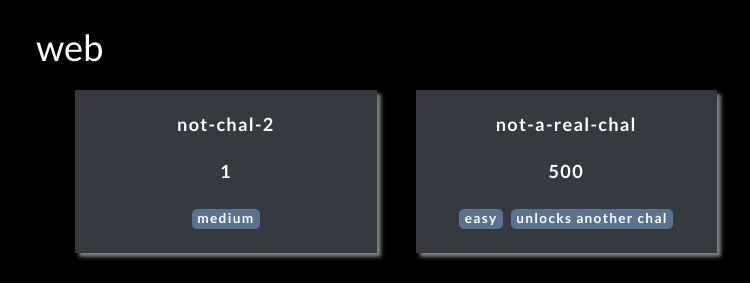

# nicc-ctfd

Fork of [CTFd](https://github.com/CTFd/CTFd)'s [core theme](https://github.com/CTFd/CTFd/tree/master/CTFd/themes/core) modified to show challenge tags on the "Challenges" page.

# Installing the Theme

Please refer to [CTFd's documentation](https://docs.ctfd.io/docs/themes/overview/#uploading-custom-themes). For self-hosted instances, add this repo to the `themes` directory. For CTFd hosted instances, zip up this repository and upload it to the CTFd portal. Note that only certain CTFd hosted tiers support custom themes and they require approval.

# Making Modifications

Changes should be made to files in the [`assets`](./assets) and [`templates`](./templates) directories. Once changes are made, a build will have to be ran to generate the [`static`](./static) files. You can do this by following one of the below options:

* Push your changes to this repository. The changes will be automatically built and commited by GitHub Actions.

    OR

* Locally run `yarn install` and then `yarn build`.